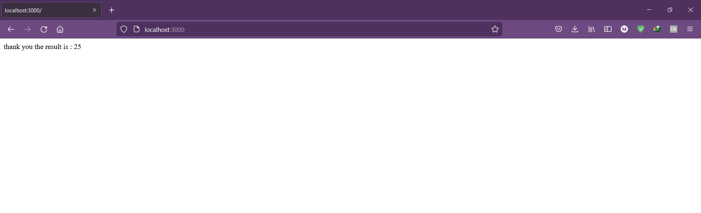
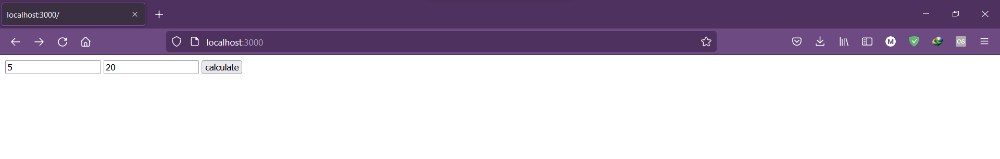

# calculator
simple web calculator
 
a simple project to apply on js and build a completed website from scratch
you need to have node js installed to start it
## Instructions
- download the files in the folder  
- open any cli and type "node calc.js"
- enter 2 numbers in the fields and it will add them

## Demo

